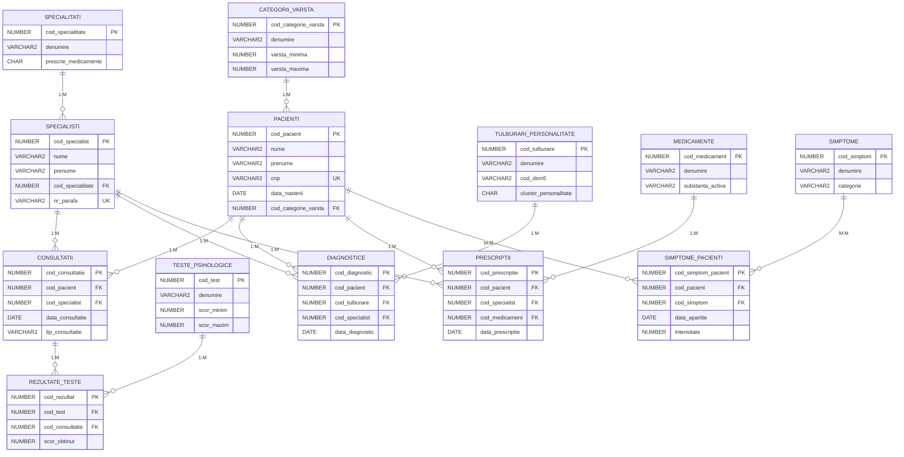

# Diagrama Conceptuală - Sistem Bază de Date pentru Psihiatrie și Psihologie

## Descriere

Diagrama conceptuală transformă modelul entitate-relație într-o reprezentare logică a tabelelor bazei de date, eliminând conceptele abstracte și concentrându-se pe structura tabelelor și relațiile dintre ele.

## Tabelele din Diagrama Conceptuală

### 1. CATEGORII_VARSTA
```
CATEGORII_VARSTA
├── cod_categorie_varsta (PK)
├── denumire
├── varsta_minima
├── varsta_maxima
└── descriere
```

### 2. PACIENTI
```
PACIENTI
├── cod_pacient (PK)
├── nume
├── prenume
├── cnp
├── data_nasterii
├── sex
├── telefon
├── email
├── adresa
├── cod_categorie_varsta (FK → CATEGORII_VARSTA)
├── data_inregistrarii
└── reprezentant_legal
```

### 3. SPECIALITATI
```
SPECIALITATI
├── cod_specialitate (PK)
├── denumire
├── prescrie_medicamente
└── descriere
```

### 4. SPECIALISTI
```
SPECIALISTI
├── cod_specialist (PK)
├── nume
├── prenume
├── cod_specialitate (FK → SPECIALITATI)
├── nr_parafa
├── telefon
├── email
├── data_angajarii
└── activ
```

### 5. CONSULTATII
```
CONSULTATII
├── cod_consultatie (PK)
├── cod_pacient (FK → PACIENTI)
├── cod_specialist (FK → SPECIALISTI)
├── data_consultatie
├── ora_consultatie
├── durata_minute
├── tip_consultatie
├── observatii
└── cost
```

### 6. TESTE_PSIHOLOGICE
```
TESTE_PSIHOLOGICE
├── cod_test (PK)
├── denumire
├── acronim
├── scor_minim
├── scor_maxim
├── durata_aplicare
├── categorie_varsta_min
├── categorie_varsta_max
└── descriere
```

### 7. REZULTATE_TESTE
```
REZULTATE_TESTE
├── cod_rezultat (PK)
├── cod_test (FK → TESTE_PSIHOLOGICE)
├── cod_consultatie (FK → CONSULTATII)
├── scor_obtinut
├── interpretare
├── data_aplicarii
└── observatii
```

### 8. TULBURARI_PERSONALITATE
```
TULBURARI_PERSONALITATE
├── cod_tulburare (PK)
├── denumire
├── cod_dsm5
├── cod_icd11
├── cluster_personalitate
├── severitate
└── descriere
```

### 9. DIAGNOSTICE
```
DIAGNOSTICE
├── cod_diagnostic (PK)
├── cod_pacient (FK → PACIENTI)
├── cod_tulburare (FK → TULBURARI_PERSONALITATE)
├── cod_specialist (FK → SPECIALISTI)
├── data_diagnostic
├── certitudinea
└── observatii
```

### 10. MEDICAMENTE
```
MEDICAMENTE
├── cod_medicament (PK)
├── denumire
├── substanta_activa
├── concentratie
├── forma_farmaceutica
├── producator
└── contraindicatii
```

### 11. PRESCRIPTII
```
PRESCRIPTII
├── cod_prescriptie (PK)
├── cod_pacient (FK → PACIENTI)
├── cod_specialist (FK → SPECIALISTI)
├── cod_medicament (FK → MEDICAMENTE)
├── data_prescriptie
├── doza
├── frecventa
├── durata_tratament
└── instructiuni
```

### 12. SIMPTOME
```
SIMPTOME
├── cod_simptom (PK)
├── denumire
├── descriere
└── categorie
```

### 13. SIMPTOME_PACIENTI (Tabel Asociativ)
```
SIMPTOME_PACIENTI
├── cod_simptom_pacient (PK)
├── cod_pacient (FK → PACIENTI)
├── cod_simptom (FK → SIMPTOME)
├── data_aparitie
├── intensitate
└── observatii
```

## Relațiile în Diagrama Conceptuală

### Relații 1:M (Unul la Mulți)

1. **CATEGORII_VARSTA → PACIENTI**
   - O categorie de vârstă poate avea mulți pacienți
   - Un pacient aparține unei singure categorii de vârstă

2. **SPECIALITATI → SPECIALISTI**
   - O specialitate poate avea mulți specialiști
   - Un specialist are o singură specialitate

3. **PACIENTI → CONSULTATII**
   - Un pacient poate avea multe consultații
   - O consultație aparține unui singur pacient

4. **SPECIALISTI → CONSULTATII**
   - Un specialist poate efectua multe consultații
   - O consultație este efectuată de un singur specialist

5. **TESTE_PSIHOLOGICE → REZULTATE_TESTE**
   - Un test poate genera multe rezultate
   - Un rezultat aparține unui singur test

6. **CONSULTATII → REZULTATE_TESTE**
   - O consultație poate include multe rezultate de teste
   - Un rezultat aparține unei singure consultații

7. **TULBURARI_PERSONALITATE → DIAGNOSTICE**
   - O tulburare poate fi diagnosticată de multe ori
   - Un diagnostic se referă la o singură tulburare

8. **PACIENTI → DIAGNOSTICE**
   - Un pacient poate avea multe diagnostice
   - Un diagnostic aparține unui singur pacient

9. **SPECIALISTI → DIAGNOSTICE**
   - Un specialist poate stabili multe diagnostice
   - Un diagnostic este stabilit de un singur specialist

10. **MEDICAMENTE → PRESCRIPTII**
    - Un medicament poate fi prescris de multe ori
    - O prescripție se referă la un singur medicament

11. **PACIENTI → PRESCRIPTII**
    - Un pacient poate primi multe prescripții
    - O prescripție aparține unui singur pacient

12. **SPECIALISTI → PRESCRIPTII**
    - Un specialist poate emite multe prescripții
    - O prescripție este emisă de un singur specialist

### Relația M:M (Mulți la Mulți) - Implementată prin Tabel Asociativ

13. **PACIENTI ←→ SIMPTOME prin SIMPTOME_PACIENTI**
    - Un pacient poate prezenta multe simptome
    - Un simptom poate fi prezent la mulți pacienți
    - Tabelul asociativ SIMPTOME_PACIENTI păstrează informații adiționale: data_aparitie, intensitate, observatii

## Caracteristici ale Diagramei Conceptuale

### Respectarea Cerințelor
- ✅ **Minimum 6 tabele**: Diagrama conține 13 tabele
- ✅ **Cel puțin un tabel asociativ**: SIMPTOME_PACIENTI este tabel asociativ

### Transformări din Modelul Entitate-Relație
1. **Entitățile** au devenit **tabele**
2. **Atributele** au devenit **coloane** cu tipuri de date specifice
3. **Relațiile 1:M** sunt implementate prin **chei străine**
4. **Relațiile M:M** sunt implementate prin **tabele asociative**
5. **Cheile primare** sunt definite explicit

### Integritatea Referențială
- Toate cheile străine (FK) sunt definite cu referințe către tabelele părinte
- Constrângerile de integritate sunt implementate prin tipuri de date și restricții
- Relațiile păstrează consistența datelor

## Reprezentare Grafică Simplificată

```
CATEGORII_VARSTA ||--o{ PACIENTI
SPECIALITATI ||--o{ SPECIALISTI
PACIENTI ||--o{ CONSULTATII
SPECIALISTI ||--o{ CONSULTATII
CONSULTATII ||--o{ REZULTATE_TESTE
TESTE_PSIHOLOGICE ||--o{ REZULTATE_TESTE
PACIENTI ||--o{ DIAGNOSTICE
SPECIALISTI ||--o{ DIAGNOSTICE
TULBURARI_PERSONALITATE ||--o{ DIAGNOSTICE
PACIENTI ||--o{ PRESCRIPTII
SPECIALISTI ||--o{ PRESCRIPTII
MEDICAMENTE ||--o{ PRESCRIPTII
PACIENTI }o--o{ SIMPTOME [prin SIMPTOME_PACIENTI]
```

## Diagrama Conceptuală în Mermaid


## Diagrama Conceptuală Simplificată în Mermaid


