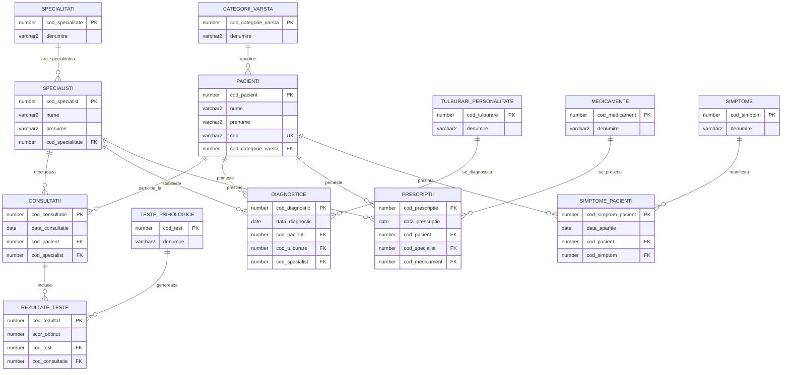

# Diagrama Entitate-Relație - Sistem de Management Clinică Psihologie

## Entități

### CATEGORII_VARSTA
- **cod_categorie_varsta** (PK) - number
- denumire - varchar2

### PACIENTI
- **cod_pacient** (PK) - number
- nume - varchar2
- prenume - varchar2
- cnp (UK) - varchar2
- cod_categorie_varsta (FK) - number

### SPECIALITATI
- **cod_specialitate** (PK) - number
- denumire - varchar2

### SPECIALISTI
- **cod_specialist** (PK) - number
- nume - varchar2
- prenume - varchar2
- cod_specialitate (FK) - number

### CONSULTATII
- **cod_consultatie** (PK) - number
- data_consultatie - date
- cod_pacient (FK) - number
- cod_specialist (FK) - number

### TESTE_PSIHOLOGICE
- **cod_test** (PK) - number
- denumire - varchar2

### REZULTATE_TESTE
- **cod_rezultat** (PK) - number
- scor_obtinut - number
- cod_test (FK) - number
- cod_consultatie (FK) - number

### TULBURARI_PERSONALITATE
- **cod_tulburare** (PK) - number
- denumire - varchar2

### DIAGNOSTICE
- **cod_diagnostic** (PK) - number
- data_diagnostic - date
- cod_pacient (FK) - number
- cod_tulburare (FK) - number
- cod_specialist (FK) - number

### MEDICAMENTE
- **cod_medicament** (PK) - number
- denumire - varchar2

### PRESCRIPTII
- **cod_prescriptie** (PK) - number
- data_prescriptie - date
- cod_pacient (FK) - number
- cod_specialist (FK) - number
- cod_medicament (FK) - number

### SIMPTOME
- **cod_simptom** (PK) - number
- denumire - varchar2

### SIMPTOME_PACIENTI
- **cod_simptom_pacient** (PK) - number
- data_aparitie - date
- cod_pacient (FK) - number
- cod_simptom (FK) - number

## Relații (1:M)

1. **CATEGORII_VARSTA** ──→ **PACIENTI** (1:M)
   - O categorie de vârstă poate avea mulți pacienți
   - Un pacient aparține unei singure categorii de vârstă

2. **SPECIALITATI** ──→ **SPECIALISTI** (1:M)
   - O specialitate poate avea mulți specialiști
   - Un specialist are o singură specialitate

3. **PACIENTI** ──→ **CONSULTATII** (1:M)
   - Un pacient poate avea multe consultații
   - O consultație aparține unui singur pacient

4. **SPECIALISTI** ──→ **CONSULTATII** (1:M)
   - Un specialist poate efectua multe consultații
   - O consultație este efectuată de un singur specialist

5. **TESTE_PSIHOLOGICE** ──→ **REZULTATE_TESTE** (1:M)
   - Un test poate genera multe rezultate
   - Un rezultat aparține unui singur test

6. **CONSULTATII** ──→ **REZULTATE_TESTE** (1:M)
   - O consultație poate include multe rezultate de teste
   - Un rezultat aparține unei singure consultații

7. **TULBURARI_PERSONALITATE** ──→ **DIAGNOSTICE** (1:M)
   - O tulburare poate fi diagnosticată la mulți pacienți
   - Un diagnostic se referă la o singură tulburare

8. **PACIENTI** ──→ **DIAGNOSTICE** (1:M)
   - Un pacient poate primi multe diagnostice
   - Un diagnostic aparține unui singur pacient

9. **SPECIALISTI** ──→ **DIAGNOSTICE** (1:M)
   - Un specialist poate stabili multe diagnostice
   - Un diagnostic este stabilit de un singur specialist

10. **MEDICAMENTE** ──→ **PRESCRIPTII** (1:M)
    - Un medicament poate fi prescris în multe prescripții
    - O prescripție se referă la un singur medicament

11. **PACIENTI** ──→ **PRESCRIPTII** (1:M)
    - Un pacient poate primi multe prescripții
    - O prescripție aparține unui singur pacient

12. **SPECIALISTI** ──→ **PRESCRIPTII** (1:M)
    - Un specialist poate prescrie multe medicamente
    - O prescripție este făcută de un singur specialist

13. **SIMPTOME** ──→ **SIMPTOME_PACIENTI** (1:M)
    - Un simptom poate fi manifestat de mulți pacienți
    - O manifestare se referă la un singur simptom

14. **PACIENTI** ──→ **SIMPTOME_PACIENTI** (1:M)
    - Un pacient poate prezenta multe simptome
    - O manifestare aparține unui singur pacient

## Constrângeri de Integritate

- **Chei primare (PK)**: Identificatori unici pentru fiecare entitate
- **Chei unice (UK)**: CNP pentru pacienți, nr_parafa pentru specialiști
- **Chei străine (FK)**: Asigură integritatea referențială între tabele
- **Constrângeri de domeniu**: Validări pentru sex (M/F), tipuri de consultații, etc.

