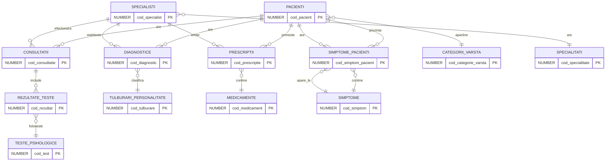

```mermaid
erDiagram
    PACIENTI ||--o{ CONSULTATII : are
    PACIENTI ||--o{ DIAGNOSTICE : are
    PACIENTI ||--o{ PRESCRIPTII : primeste
    PACIENTI ||--o{ SIMPTOME_PACIENTI : prezinta
    PACIENTI }o--|| CATEGORII_VARSTA : apartine

    SPECIALISTI ||--o{ CONSULTATII : efectueaza
    SPECIALISTI ||--o{ DIAGNOSTICE : stabileste
    SPECIALISTI ||--o{ PRESCRIPTII : emite
    SPECIALISTI }o--|| SPECIALITATI : are

    CONSULTATII ||--o{ REZULTATE_TESTE : include
    REZULTATE_TESTE }o--|| TESTE_PSIHOLOGICE : foloseste

    DIAGNOSTICE }o--|| TULBURARI_PERSONALITATE : clasifica

    PRESCRIPTII }o--|| MEDICAMENTE : contine

    SIMPTOME ||--o{ SIMPTOME_PACIENTI : apare_la

    SIMPTOME_PACIENTI }o--|| PACIENTI : are
    SIMPTOME_PACIENTI }o--|| SIMPTOME : contine

    PACIENTI {
        NUMBER cod_pacient PK
    }
    SPECIALISTI {
        NUMBER cod_specialist PK
    }
    SPECIALITATI {
        NUMBER cod_specialitate PK
    }
    CONSULTATII {
        NUMBER cod_consultatie PK
    }
    TESTE_PSIHOLOGICE {
        NUMBER cod_test PK
    }
    REZULTATE_TESTE {
        NUMBER cod_rezultat PK
    }
    TULBURARI_PERSONALITATE {
        NUMBER cod_tulburare PK
    }
    DIAGNOSTICE {
        NUMBER cod_diagnostic PK
    }
    MEDICAMENTE {
        NUMBER cod_medicament PK
    }
    PRESCRIPTII {
        NUMBER cod_prescriptie PK
    }
    CATEGORII_VARSTA {
        NUMBER cod_categorie_varsta PK
    }
    SIMPTOME {
        NUMBER cod_simptom PK
    }
    SIMPTOME_PACIENTI {
        NUMBER cod_simptom_pacient PK
    }
```
