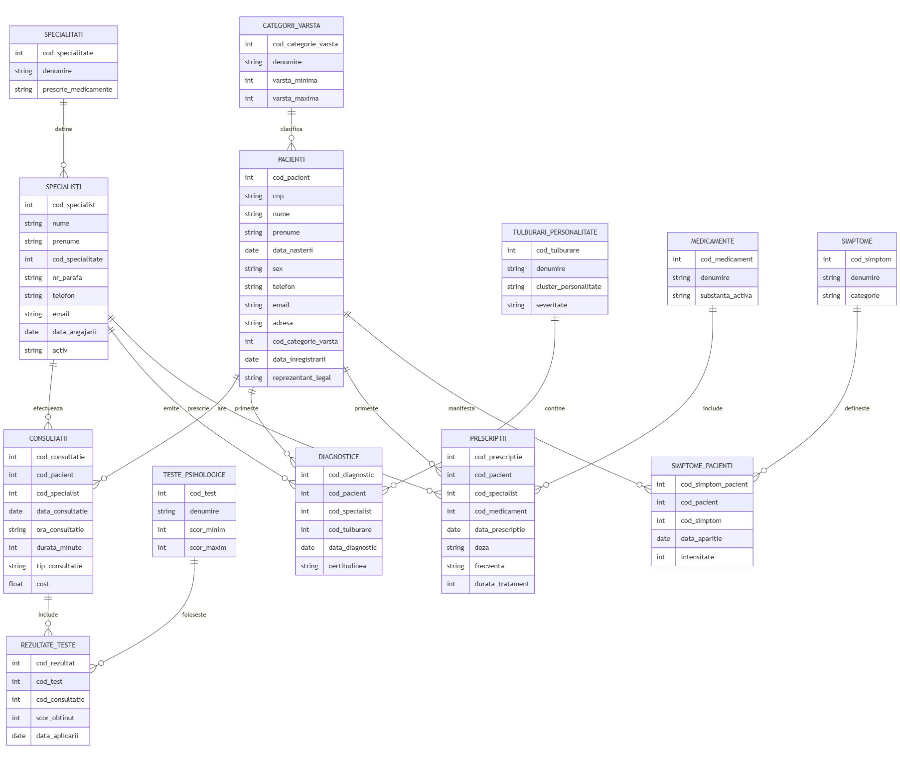
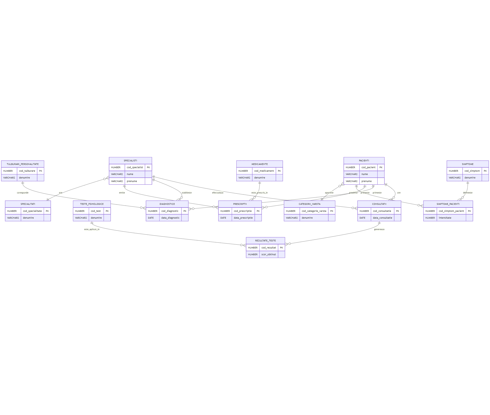
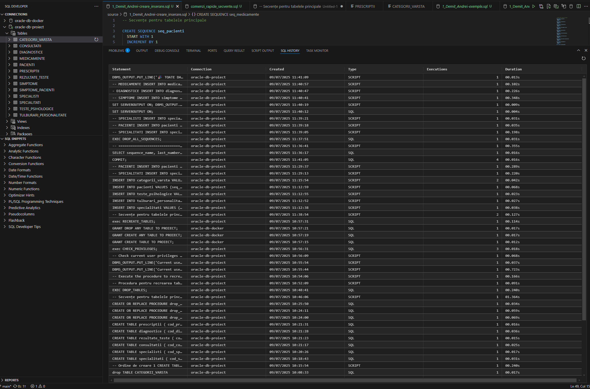

## 1. **Descrierea modelului real, a utilității acestuia și a regulilor de funcționare**

### Modelul real

Sistemul propus este o bază de date destinată clinicilor și cabinetelor de psihiatrie și psihologie, având ca scop facilitarea evaluării, diagnosticării și monitorizării pacienților cu suspiciuni de tulburări de personalitate.

### Utilitatea sistemului

- **Evaluare sistematică:** Permite aplicarea standardizată a testelor psihologice și a instrumentelor de screening.
- **Istoric medical complet:** Păstrează evidența consultațiilor, simptomelor și tratamentelor pentru fiecare pacient.
- **Diagnostic diferențial:** Facilitează identificarea și diferențierea tulburărilor de personalitate.
- **Monitorizare progres:** Urmărește evoluția pacienților în timp și eficiența tratamentelor aplicate.
- **Gestionare resurse:** Optimizează programarea consultațiilor și alocarea specialiștilor.

### Regulile de funcționare

1. **Evaluarea pacienților:**
    - Fiecare pacient poate fi evaluat de unul sau mai mulți specialiști (psihiatri sau psihologi).
    - Evaluarea se realizează prin aplicarea de teste standardizate (ex: MMPI, Beck, Hamilton).

2. **Interpretarea rezultatelor:**
    - Rezultatele testelor sunt interpretate și consemnate în fișa pacientului.
    - Diagnosticul se stabilește conform criteriilor DSM-5 sau ICD-11.

3. **Prescrierea tratamentelor:**
    - Psihiatrii pot prescrie medicamente.
    - Psihologii pot recomanda terapii.

4. **Monitorizarea pacienților:**
    - Consultațiile de control sunt programate periodic pentru monitorizarea evoluției pacientului.

## 2. Prezentarea constrângerilor (restricții, reguli) impuse asupra modelului

### Constrângeri de integritate
- **Unicitate:** Fiecare pacient are un singur CNP/ID unic.
- **Referențială:** Consultațiile trebuie să fie asociate cu un pacient și un medic existent.
- **Temporală:** Data consultației nu poate fi în viitor.
- **Calificări:** Doar psihiatrii pot prescrie medicamente.
- **Vârstă:** Pacienții minori necesită acordul părinților/tutorilor.

### Constrângeri de validare
- **Intervale scoruri:** Scorurile testelor trebuie să fie în intervalele specifice fiecărui test.
- **Rezultate test:** Rezultatele trebuie să fie introduse doar după aplicarea testului.
- **Prescripții:** Medicamentele pot fi prescrise doar pacienților cu anumite diagnostice.
- **Doze terapeutice:** Dozele medicamentelor trebuie să respecte limitele terapeutice.

### Constrângeri de securitate
- **Acces restricționat:** Accesul la datele medicale este restricționat pe roluri.
- **Auditare:** Istoricul modificărilor trebuie păstrat pentru auditare.
- **Confidențialitate:** Confidențialitatea datelor pacienților trebuie asigurată.


## 3. Descrierea entităților, incluzând precizarea cheii primare

### PACIENTI
- **Cheie primară:** `cod_pacient`
- **Descriere:** Informații despre pacienții care se prezintă pentru evaluare.

### SPECIALISTI
- **Cheie primară:** `cod_specialist`
- **Descriere:** Psihiatri și psihologi care efectuează evaluările.

### SPECIALITATI
- **Cheie primară:** `cod_specialitate`
- **Descriere:** Tipurile de specializări (psihiatrie, psihologie clinică, etc.).

### CONSULTATII
- **Cheie primară:** `cod_consultatie`
- **Descriere:** Ședințele de evaluare și tratament.

### TESTE_PSIHOLOGICE
- **Cheie primară:** `cod_test`
- **Descriere:** Instrumentele de evaluare standardizate.

### REZULTATE_TESTE
- **Cheie primară:** `cod_rezultat`
- **Descriere:** Scorurile obținute la testele aplicate.

### TULBURARI_PERSONALITATE
- **Cheie primară:** `cod_tulburare`
- **Descriere:** Clasificarea tulburărilor conform DSM-5/ICD-11.

### DIAGNOSTICE
- **Cheie primară:** `cod_diagnostic`
- **Descriere:** Diagnosticele stabilite pentru pacienți.

### MEDICAMENTE
- **Cheie primară:** `cod_medicament`
- **Descriere:** Medicamentele utilizate în tratament.

### PRESCRIPTII
- **Cheie primară:** `cod_prescriptie`
- **Descriere:** Prescripțiile medicale emise.

### CATEGORII_VARSTA
- **Cheie primară:** `cod_categorie_varsta`
- **Descriere:** Grupe de vârstă pentru evaluare specifică.

### SIMPTOME
- **Cheie primară:** `cod_simptom`
- **Descriere:** Simptomele identificate la pacienți.

### SIMPTOME_PACIENTI
- **Cheie primară:** `cod_simptom_pacient`
- **Descriere:** Asocierea simptomelor cu pacienții (tabel asociativ).

## 4. Descrierea relațiilor, incluzând precizarea cardinalității acestora

### Relații 1:M (Unul la mulți)

1. **CATEGORII_VARSTA - PACIENTI (1:M)**
   - Cardinalitate: (1,1) - (0,N)
   - Un pacient aparține unei singure categorii de vârstă (participare totală)
   - O categorie de vârstă poate include zero sau mai mulți pacienți (participare parțială)

2. **SPECIALITATI - SPECIALISTI (1:M)**
   - Cardinalitate: (1,1) - (0,N)
   - Un specialist are o singură specialitate (participare totală)
   - O specialitate poate fi practicată de zero sau mai mulți specialiști (participare parțială)

3. **PACIENTI - CONSULTATII (1:M)**
   - Cardinalitate: (1,1) - (0,N)
   - O consultație aparține unui singur pacient (participare totală)
   - Un pacient poate avea zero sau mai multe consultații (participare parțială)

4. **SPECIALISTI - CONSULTATII (1:M)**
   - Cardinalitate: (1,1) - (0,N)
   - O consultație este efectuată de un singur specialist (participare totală)
   - Un specialist poate efectua zero sau mai multe consultații (participare parțială)

5. **TESTE_PSIHOLOGICE - REZULTATE_TESTE (1:M)**
   - Cardinalitate: (1,1) - (0,N)
   - Un rezultat aparține unui singur test (participare totală)
   - Un test poate genera zero sau mai multe rezultate (participare parțială)

6. **CONSULTATII - REZULTATE_TESTE (1:M)**
   - Cardinalitate: (1,1) - (0,N)
   - Un rezultat aparține unei singure consultații (participare totală)
   - O consultație poate include zero sau mai multe rezultate de teste (participare parțială)

7. **TULBURARI_PERSONALITATE - DIAGNOSTICE (1:M)**
   - Cardinalitate: (1,1) - (0,N)
   - Un diagnostic se referă la o singură tulburare (participare totală)
   - O tulburare poate fi diagnosticată zero sau de mai multe ori (participare parțială)

8. **PACIENTI - DIAGNOSTICE (1:M)**
   - Cardinalitate: (1,1) - (0,N)
   - Un diagnostic aparține unui singur pacient (participare totală)
   - Un pacient poate avea zero sau mai multe diagnostice (participare parțială)

9. **SPECIALISTI - DIAGNOSTICE (1:M)**
   - Cardinalitate: (1,1) - (0,N)
   - Un diagnostic este stabilit de un singur specialist (participare totală)
   - Un specialist poate stabili zero sau mai multe diagnostice (participare parțială)

10. **MEDICAMENTE - PRESCRIPTII (1:M)**
    - Cardinalitate: (1,1) - (0,N)
    - O prescripție se referă la un singur medicament (participare totală)
    - Un medicament poate fi prescris zero sau de mai multe ori (participare parțială)

11. **PACIENTI - PRESCRIPTII (1:M)**
    - Cardinalitate: (1,1) - (0,N)
    - O prescripție aparține unui singur pacient (participare totală)
    - Un pacient poate primi zero sau mai multe prescripții (participare parțială)

12. **SPECIALISTI - PRESCRIPTII (1:M)**
    - Cardinalitate: (1,1) - (0,N)
    - O prescripție este emisă de un singur specialist (participare totală)
    - Un specialist poate emite zero sau mai multe prescripții (participare parțială)

### Relații M:M (Mulți la mulți) - implementate prin tabele asociative

13. **PACIENTI - SIMPTOME (M:M) prin SIMPTOME_PACIENTI**
    - Cardinalitate: (0,N) - (0,N)
    - Un pacient poate prezenta zero sau mai multe simptome (participare parțială)
    - Un simptom poate fi prezent la zero sau mai mulți pacienți (participare parțială)
    - Tabelul asociativ SIMPTOME_PACIENTI conține atribute adiționale: data_aparitie, intensitate, observatii

### Notații pentru cardinalitate:
- **(0,1)**: Opțional, maximum unul
- **(1,1)**: Obligatoriu, exact unul
- **(0,N)**: Opțional, oricâte
- **(1,N)**: Obligatoriu, cel puțin unul

## 5. Descrierea atributelor, incluzând tipul de date și eventualele constrângeri, valori implicite, valori posibile ale atributelor

### PACIENTI
- **cod_pacient**: `NUMBER`, PK, NOT NULL  
- **nume**: `VARCHAR2(50)`, NOT NULL  
- **prenume**: `VARCHAR2(50)`, NOT NULL  
- **cnp**: `VARCHAR2(13)`, UNIQUE, NOT NULL  
- **data_nasterii**: `DATE`, NOT NULL  
- **sex**: `CHAR(1)`, CHECK IN ('M', 'F'), NOT NULL  
- **telefon**: `VARCHAR2(20)`  
- **email**: `VARCHAR2(100)`  
- **adresa**: `VARCHAR2(200)`  
- **cod_categorie_varsta**: `NUMBER`, FK, NOT NULL  
- **data_inregistrarii**: `DATE`, DEFAULT SYSDATE  
- **reprezentant_legal**: `VARCHAR2(100)` (pentru minori)  

### SPECIALISTI
- **cod_specialist**: `NUMBER`, PK, NOT NULL  
- **nume**: `VARCHAR2(50)`, NOT NULL  
- **prenume**: `VARCHAR2(50)`, NOT NULL  
- **cod_specialitate**: `NUMBER`, FK, NOT NULL  
- **nr_parafa**: `VARCHAR2(20)`, UNIQUE, NOT NULL  
- **telefon**: `VARCHAR2(20)`  
- **email**: `VARCHAR2(100)`  
- **data_angajarii**: `DATE`, DEFAULT SYSDATE  
- **activ**: `CHAR(1)`, CHECK IN ('Y', 'N'), DEFAULT 'Y'  

### SPECIALITATI
- **cod_specialitate**: `NUMBER`, PK, NOT NULL  
- **denumire**: `VARCHAR2(100)`, NOT NULL  
- **prescrie_medicamente**: `CHAR(1)`, CHECK IN ('Y', 'N'), DEFAULT 'N'  
- **descriere**: `VARCHAR2(500)`  

### CONSULTATII
- **cod_consultatie**: `NUMBER`, PK, NOT NULL  
- **cod_pacient**: `NUMBER`, FK, NOT NULL  
- **cod_specialist**: `NUMBER`, FK, NOT NULL  
- **data_consultatie**: `DATE`, NOT NULL  
- **ora_consultatie**: `VARCHAR2(5)`, NOT NULL  
- **durata_minute**: `NUMBER`, CHECK > 0, DEFAULT 50  
- **tip_consultatie**: `VARCHAR2(20)`, CHECK IN ('EVALUARE_INITIALA', 'CONTROL', 'TERAPIE')  
- **observatii**: `CLOB`  
- **cost**: `NUMBER(8,2)`, CHECK >= 0  

### TESTE_PSIHOLOGICE
- **cod_test**: `NUMBER`, PK, NOT NULL  
- **denumire**: `VARCHAR2(100)`, NOT NULL  
- **acronim**: `VARCHAR2(10)`  
- **scor_minim**: `NUMBER`, NOT NULL  
- **scor_maxim**: `NUMBER`, NOT NULL  
- **durata_aplicare**: `NUMBER` (în minute)  
- **categorie_varsta_min**: `NUMBER`, NOT NULL  
- **categorie_varsta_max**: `NUMBER`, NOT NULL  
- **descriere**: `VARCHAR2(1000)`  

### REZULTATE_TESTE
- **cod_rezultat**: `NUMBER`, PK, NOT NULL  
- **cod_test**: `NUMBER`, FK, NOT NULL  
- **cod_consultatie**: `NUMBER`, FK, NOT NULL  
- **scor_obtinut**: `NUMBER`, NOT NULL  
- **interpretare**: `VARCHAR2(500)`  
- **data_aplicarii**: `DATE`, DEFAULT SYSDATE  
- **observatii**: `VARCHAR2(1000)`  

### TULBURARI_PERSONALITATE
- **cod_tulburare**: `NUMBER`, PK, NOT NULL  
- **denumire**: `VARCHAR2(100)`, NOT NULL  
- **cod_dsm5**: `VARCHAR2(10)`  
- **cod_icd11**: `VARCHAR2(10)`  
- **cluster_personalitate**: `CHAR(1)`, CHECK IN ('A', 'B', 'C')  
- **severitate**: `VARCHAR2(20)`, CHECK IN ('USOARA', 'MODERATA', 'SEVERA')  
- **descriere**: `CLOB`  

### DIAGNOSTICE
- **cod_diagnostic**: `NUMBER`, PK, NOT NULL  
- **cod_pacient**: `NUMBER`, FK, NOT NULL  
- **cod_tulburare**: `NUMBER`, FK, NOT NULL  
- **cod_specialist**: `NUMBER`, FK, NOT NULL  
- **data_diagnostic**: `DATE`, DEFAULT SYSDATE  
- **certitudinea**: `VARCHAR2(20)`, CHECK IN ('CONFIRMAT', 'PROBABILIST', 'DIFERENTIAL')  
- **observatii**: `VARCHAR2(1000)`  

### MEDICAMENTE
- **cod_medicament**: `NUMBER`, PK, NOT NULL  
- **denumire**: `VARCHAR2(100)`, NOT NULL  
- **substanta_activa**: `VARCHAR2(100)`, NOT NULL  
- **concentratie**: `VARCHAR2(50)`  
- **forma_farmaceutica**: `VARCHAR2(50)`  
- **producator**: `VARCHAR2(100)`  
- **contraindicatii**: `VARCHAR2(1000)`  

### PRESCRIPTII
- **cod_prescriptie**: `NUMBER`, PK, NOT NULL  
- **cod_pacient**: `NUMBER`, FK, NOT NULL  
- **cod_specialist**: `NUMBER`, FK, NOT NULL  
- **cod_medicament**: `NUMBER`, FK, NOT NULL  
- **data_prescriptie**: `DATE`, DEFAULT SYSDATE  
- **doza**: `VARCHAR2(100)`, NOT NULL  
- **frecventa**: `VARCHAR2(100)`, NOT NULL  
- **durata_tratament**: `NUMBER` (în zile)  
- **instructiuni**: `VARCHAR2(500)`  

### CATEGORII_VARSTA
- **cod_categorie_varsta**: `NUMBER`, PK, NOT NULL  
- **denumire**: `VARCHAR2(50)`, NOT NULL  
- **varsta_minima**: `NUMBER`, NOT NULL  
- **varsta_maxima**: `NUMBER`, NOT NULL  
- **descriere**: `VARCHAR2(200)`  

### SIMPTOME
- **cod_simptom**: `NUMBER`, PK, NOT NULL  
- **denumire**: `VARCHAR2(100)`, NOT NULL  
- **descriere**: `VARCHAR2(500)`  
- **categorie**: `VARCHAR2(50)`  

### SIMPTOME_PACIENTI
- **cod_simptom_pacient**: `NUMBER`, PK, NOT NULL  
- **cod_pacient**: `NUMBER`, FK, NOT NULL  
- **cod_simptom**: `NUMBER`, FK, NOT NULL  
- **data_aparitie**: `DATE`  
- **intensitate**: `NUMBER`, CHECK BETWEEN 1 AND 10  
- **observatii**: `VARCHAR2(500)`  

## 6. Realizarea diagramei entitate-relație corespunzătoare descrierii de la punctele 3-5.



## 7. Realizarea diagramei conceptuale corespunzătoare diagramei entitate-relație proiectate la punctul 6. Diagrama conceptuală obținută trebuie să conțină minimum 6 tabele (fără considerarea subentităților), dintre care cel puțin un tabel asociativ.



## 8. Enumerarea schemelor relaționale corespunzătoare diagramei conceptuale proiectate la punctul 7.


CATEGORII_VARSTA
```
CREATE TABLE categorii_varsta (
    cod_categorie_varsta NUMBER PRIMARY KEY,
    denumire VARCHAR2(50) NOT NULL,
    varsta_minima NUMBER NOT NULL,
    varsta_maxima NUMBER NOT NULL,
    descriere VARCHAR2(200)
);
```

PACIENTI
```
CREATE TABLE pacienti (
    cod_pacient NUMBER PRIMARY KEY,
    cnp VARCHAR2(13) UNIQUE NOT NULL,
    nume VARCHAR2(50) NOT NULL,
    prenume VARCHAR2(50) NOT NULL,
    data_nasterii DATE NOT NULL,
    sex CHAR(1) CHECK (sex IN ('M', 'F')) NOT NULL,
    telefon VARCHAR2(20),
    email VARCHAR2(100),
    adresa VARCHAR2(200),
    cod_categorie_varsta NUMBER NOT NULL,
    data_inregistrarii DATE DEFAULT SYSDATE,
    reprezentant_legal VARCHAR2(100),
    FOREIGN KEY (cod_categorie_varsta) REFERENCES categorii_varsta(cod_categorie_varsta)
);
```
SPECIALITATI
```
CREATE TABLE specialitati (
    cod_specialitate NUMBER PRIMARY KEY,
    denumire VARCHAR2(100) NOT NULL,
    prescrie_medicamente CHAR(1) CHECK (prescrie_medicamente IN ('Y', 'N')) DEFAULT 'N',
    descriere VARCHAR2(500)
);
```
SPECIALISTI
```
CREATE TABLE specialisti (
    cod_specialist NUMBER PRIMARY KEY,
    nume VARCHAR2(50) NOT NULL,
    prenume VARCHAR2(50) NOT NULL,
    cod_specialitate NUMBER NOT NULL,
    nr_parafa VARCHAR2(20) UNIQUE NOT NULL,
    telefon VARCHAR2(20),
    email VARCHAR2(100),
    data_angajarii DATE DEFAULT SYSDATE,
    activ CHAR(1) CHECK (activ IN ('Y', 'N')) DEFAULT 'Y',
    FOREIGN KEY (cod_specialitate) REFERENCES specialitati(cod_specialitate)
);
```
CONSULTATII
```
CREATE TABLE consultatii (
    cod_consultatie NUMBER PRIMARY KEY,
    cod_pacient NUMBER NOT NULL,
    cod_specialist NUMBER NOT NULL,
    data_consultatie DATE NOT NULL,
    ora_consultatie VARCHAR2(5) NOT NULL,
    durata_minute NUMBER CHECK (durata_minute > 0) DEFAULT 50,
    tip_consultatie VARCHAR2(20) CHECK (tip_consultatie IN ('EVALUARE_INITIALA', 'CONTROL', 'TERAPIE')),
    observatii CLOB,
    cost NUMBER(8,2) CHECK (cost >= 0),
    FOREIGN KEY (cod_pacient) REFERENCES pacienti(cod_pacient),
    FOREIGN KEY (cod_specialist) REFERENCES specialisti(cod_specialist)
);
```
TESTE_PSIHOLOGICE
```
CREATE TABLE teste_psihologice (
    cod_test NUMBER PRIMARY KEY,
    denumire VARCHAR2(100) NOT NULL,
    acronim VARCHAR2(10),
    scor_minim NUMBER NOT NULL,
    scor_maxim NUMBER NOT NULL,
    durata_aplicare NUMBER,
    categorie_varsta_min NUMBER NOT NULL,
    categorie_varsta_max NUMBER NOT NULL,
    descriere VARCHAR2(1000)
);
```
REZULTATE_TESTE
```
CREATE TABLE rezultate_teste (
    cod_rezultat NUMBER PRIMARY KEY,
    cod_test NUMBER NOT NULL,
    cod_consultatie NUMBER NOT NULL,
    scor_obtinut NUMBER NOT NULL,
    interpretare VARCHAR2(500),
    data_aplicarii DATE DEFAULT SYSDATE,
    observatii VARCHAR2(1000),
    FOREIGN KEY (cod_test) REFERENCES teste_psihologice(cod_test),
    FOREIGN KEY (cod_consultatie) REFERENCES consultatii(cod_consultatie)
);
```
TULBURARI_PERSONALITATE
```
CREATE TABLE tulburari_personalitate (
    cod_tulburare NUMBER PRIMARY KEY,
    denumire VARCHAR2(100) NOT NULL,
    cod_dsm5 VARCHAR2(10),
    cod_icd11 VARCHAR2(10),
    cluster_personalitate CHAR(1) CHECK (cluster_personalitate IN ('A', 'B', 'C')),
    severitate VARCHAR2(20) CHECK (severitate IN ('USOARA', 'MODERATA', 'SEVERA')),
    descriere CLOB
);
```
DIAGNOSTICE
```
CREATE TABLE diagnostice (
    cod_diagnostic NUMBER PRIMARY KEY,
    cod_pacient NUMBER NOT NULL,
    cod_tulburare NUMBER NOT NULL,
    cod_specialist NUMBER NOT NULL,
    data_diagnostic DATE DEFAULT SYSDATE,
    certitudinea VARCHAR2(20) CHECK (certitudinea IN ('CONFIRMAT', 'PROBABILIST', 'DIFERENTIAL')),
    observatii VARCHAR2(1000),
    FOREIGN KEY (cod_pacient) REFERENCES pacienti(cod_pacient),
    FOREIGN KEY (cod_tulburare) REFERENCES tulburari_personalitate(cod_tulburare),
    FOREIGN KEY (cod_specialist) REFERENCES specialisti(cod_specialist)
);
```
MEDICAMENTE
```
CREATE TABLE medicamente (
    cod_medicament NUMBER PRIMARY KEY,
    denumire VARCHAR2(100) NOT NULL,
    substanta_activa VARCHAR2(100) NOT NULL,
    concentratie VARCHAR2(50),
    forma_farmaceutica VARCHAR2(50),
    producator VARCHAR2(100),
    contraindicatii VARCHAR2(1000)
);
```
PRESCRIPTII
```
CREATE TABLE prescriptii (
    cod_prescriptie NUMBER PRIMARY KEY,
    cod_pacient NUMBER NOT NULL,
    cod_specialist NUMBER NOT NULL,
    cod_medicament NUMBER NOT NULL,
    data_prescriptie DATE DEFAULT SYSDATE,
    doza VARCHAR2(100) NOT NULL,
    frecventa VARCHAR2(100) NOT NULL,
    durata_tratament NUMBER,
    instructiuni VARCHAR2(500),
    FOREIGN KEY (cod_pacient) REFERENCES pacienti(cod_pacient),
    FOREIGN KEY (cod_specialist) REFERENCES specialisti(cod_specialist),
    FOREIGN KEY (cod_medicament) REFERENCES medicamente(cod_medicament)
);
```

SIMPTOME

```
CREATE TABLE simptome (
    cod_simptom NUMBER PRIMARY KEY,
    denumire VARCHAR2(100) NOT NULL,
    descriere VARCHAR2(500),
    categorie VARCHAR2(50)
);
```

SIMPTOME_PACIENTI (tabel asociativ M:N)
```
CREATE TABLE simptome_pacienti (
    cod_simptom_pacient NUMBER PRIMARY KEY,
    cod_pacient NUMBER NOT NULL,
    cod_simptom NUMBER NOT NULL,
    data_aparitie DATE,
    intensitate NUMBER CHECK (intensitate BETWEEN 1 AND 10),
    observatii VARCHAR2(500),
    FOREIGN KEY (cod_pacient) REFERENCES pacienti(cod_pacient),
    FOREIGN KEY (cod_simptom) REFERENCES simptome(cod_simptom)
);
```

## 9. Realizarea normalizării până la forma normală 3 (FN1-FN3).

##  PUNCTUL 9 – Normalizarea relațiilor până la 3NF (și analiza BCNF, FN4, FN5)

Modelul propus a fost proiectat direct în **forma normală 3 (3NF)**, însă pentru respectarea cerințelor, se prezintă mai jos câte un exemplu de relație care nu respectă fiecare dintre formele normale FN1, FN2 și FN3, însoțit de transformarea aferentă.

---

### 9.1 – Normalizare FN1 (forma normală 1)

**Exemplu de tabel non-1NF** (valoare compusă într-un singur câmp):

```text
pacienti_ne_normalizat(cod_pacient, nume, telefon)
1, "Ion", "0745123456,0722981122"
```

**Problemă**: Atributul `telefon` conține mai multe valori → încălcarea atomicității.

**Transformare → 1NF:**

Se creează o relație separată:

```sql
telefoane_pacienti(cod_pacient, telefon)
```

Astfel, fiecare valoare atomică este stocată pe o linie distinctă.

---

### 9.2 – Normalizare FN2 (forma normală 2)

**Exemplu de tabel non-2NF** (dependență parțială față de o cheie compusă):

```text
rezultate_raw(cod_test, cod_consultatie, scor, denumire_test)
```

**Problemă**: `denumire_test` depinde doar de `cod_test`, nu de întreaga cheie compusă ⇒ violare FN2.

**Transformare → 2NF:**

```sql
teste(cod_test, denumire_test)
rezultate(cod_test, cod_consultatie, scor)
```

---

### 9.3 – Normalizare FN3 (forma normală 3)

**Exemplu de tabel non-3NF** (dependență tranzitivă):

```text
specialisti(cod_specialist, cod_specialitate, denumire_specialitate)
```

**Problemă**: `denumire_specialitate` depinde de `cod_specialitate`, nu direct de PK ⇒ violare FN3.

**Transformare → 3NF:**

```sql
specialitati(cod_specialitate, denumire_specialitate)
specialisti(cod_specialist, cod_specialitate, ...)
```

## 10. Crearea unei secvențe ce va fi utilizată în inserarea înregistrărilor în tabele (punctul 11).

## 11. Crearea tabelelor în SQL și inserarea de date coerente în fiecare dintre acestea (minimum 5 înregistrări în fiecare tabel neasociativ; minimum 10 înregistrări în tabelele asociative).



## 12. Formulați în limbaj natural și implementați 5 cereri SQL complexe ce vor utiliza, în ansamblul lor, următoarele elemente:

- subcereri sincronizate în care intervin cel puțin 3 tabele
- subcereri nesincronizate în clauza FROM
- grupări de date cu subcereri nesincronizate in care intervin cel putin 3 tabele, funcții grup, filtrare la nivel de grupuri (in cadrul aceleiasi cereri)
- ordonări si utilizarea funcțiilor NVL și DECODE (in cadrul aceleiasi cereri)
- utilizarea a cel puțin 2 funcții pe șiruri de caractere, 2 funcții pe date calendaristice, a cel puțin unei expresii CASE
- utilizarea a cel puțin 1 bloc de cerere (clauza WITH)
Observație: Într-o cerere se vor regăsi mai multe elemente dintre cele enumerate mai sus, astfel încât cele 5 cereri să le cuprindă pe toate.

Desigur! Iată o descriere **clară și profesionistă în limbaj natural** pentru fiecare dintre cele 5 interogări de la punctul 12, astfel încât să le poți include în proiectul tău.

---

## **Cererea 1 – Lista prescripțiilor pentru pacienți, cu detalii despre medicamente**

> **Ce face:**
> Această interogare extrage lista tuturor prescripțiilor medicale emise pentru pacienți de către specialiști activi.
> Pentru fiecare prescripție, sunt afișate:

* numele pacientului,
* denumirea medicamentului,
* durata tratamentului (sau „Nespecificat” dacă nu este completată),
* instrucțiunile (sau „Fără instrucțiuni” dacă sunt lipsă).

Se utilizează:

* **subcerere sincronizată** pentru filtrarea specialiștilor activi;
* funcții precum `DECODE` și `NVL` pentru a trata valorile lipsă și a îmbunătăți lizibilitatea rezultatelor;
* sortarea alfabetică după pacient și medicament.

---

## **Cererea 2 – Extrage utilizatorul din email și sexul explicitat pentru pacienți**

> **Ce face:**
> Această interogare folosește o **subcerere nesincronizată** pentru a prelua toți pacienții și apoi, în cadrul interogării externe:

* extrage partea din stânga adresei de email (username),
* calculează lungimea adresei de email,
* transformă codul de sex ('M', 'F') într-o formă explicită: „Masculin” sau „Feminin” (folosind `CASE`).

Este o cerere orientată pe **prelucrarea șirurilor de caractere**, fiind utilă pentru validare, audit sau personalizare a interfețelor.

---

## **Cererea 3 – Câți diagnostici a emis fiecare specialist + ultima dată de diagnosticare**

> **Ce face:**
> Această interogare determină **numărul de diagnostice** emise de fiecare specialist, precum și data celui mai recent diagnostic.
> Folosește:

* o **subcerere nesincronizată în clauza `FROM`**, care combină datele din tabelele `diagnostice`, `specialisti` și `pacienti`;
* **grupare (`GROUP BY`)** după numele specialistului;
* filtrare a grupurilor folosind `HAVING` pentru a păstra doar specialiștii care au emis **cel puțin 2 diagnostice**;
* agregare cu funcții precum `COUNT` și `MAX`.

---

## **Cererea 4 – Calcularea vârstei pacienților în luni + personalizare după sex**

> **Ce face:**
> Această interogare:

* calculează vârsta pacienților în **luni** (folosind `MONTHS_BETWEEN`);
* adaugă o coloană cu o **formulă de politețe** bazată pe sex (`DOMNUL`, `DOAMNA`, `PERSOANĂ`);
* completează eventualul număr de telefon lipsă cu textul „Fără telefon”;
* sortează lista începând cu pacienții cei mai în vârstă.

Această cerere este un exemplu complet de folosire a:

* **funcțiilor calendaristice**,
* expresiilor `CASE`,
* funcției `NVL`,
* și ordonării (`ORDER BY`).

---

## **Cererea 5 – Scoruri la teste psihologice și interpretare pe categorii de vârstă**

> **Ce face:**
> Aceasta este o cerere complexă care:

* folosește un **bloc de subcerere `WITH`** (common table expression),
* combină date din 4 tabele (`pacienti`, `consultatii`, `rezultate_teste`, `teste_psihologice`) pentru a extrage scorurile obținute la testele MMPI și Beck,
* interpretează scorurile în funcție de valorile obținute, folosind expresii `CASE`,
* calculează vârsta pacientului în **ani** cu zecimale,
* sortează rezultatele în funcție de vârstă și test.

Este o cerere care combină:

* **blocuri de subinterogare**,
* **funcții calendaristice** și de grupare,
* **expresii condiționale `CASE` și `DECODE`**.

---

| Cerință                                                                                         | Găsită în cererea |
| ----------------------------------------------------------------------------------------------- | ----------------- |
| Subcereri sincronizate cu ≥ 3 tabele                                                            | 1, 3, 5           |
| Subcereri nesincronizate în `FROM`                                                              | 2, 3              |
| Grupări, funcții de grup, filtrare pe grupuri                                                   | 3, 5              |
| `NVL`, `DECODE`, `ORDER BY` în aceeași interogare                                               | 1, 4, 5           |
| 2 funcții pe șiruri (`SUBSTR`, `LENGTH`), 2 funcții pe date (`TRUNC`, `MONTHS_BETWEEN`), `CASE` | 2, 4, 5           |
| Clauza `WITH` (bloc de cerere)                                                                  | 5                 |


## 13. Implementarea a 3 operații de actualizare și de suprimare a datelor utilizând subcereri.

## Comanda 1 – Ștergerea pacienților care **nu au avut nicio consultație**

```sql
DELETE FROM pacienti
WHERE cod_pacient NOT IN (
    SELECT DISTINCT cod_pacient
    FROM consultatii
);
```

> **Descriere:**
> Șterge din tabelul `pacienti` acei pacienți care **nu au nicio înregistrare** în tabelul `consultatii`.

---

## Comanda 2 – Actualizarea intensității simptomelor la pacienții care au avut scor mare la MMPI

```sql
UPDATE simptome_pacienti
SET intensitate = intensitate + 2
WHERE cod_pacient IN (
    SELECT p.cod_pacient
    FROM pacienti p
    JOIN consultatii c ON p.cod_pacient = c.cod_pacient
    JOIN rezultate_teste rt ON c.cod_consultatie = rt.cod_consultatie
    JOIN teste_psihologice t ON rt.cod_test = t.cod_test
    WHERE t.denumire = 'MMPI' AND rt.scor_obtinut > 70
);
```

> **Descriere:**
> Crește intensitatea simptomelor pentru pacienții care au obținut **scoruri peste 70** la testul MMPI (indicativ pentru tulburări severe).

---

## Comanda 3 – Anularea prescripțiilor vechi pentru pacienți fără diagnostice

```sql
DELETE FROM prescriptii
WHERE cod_pacient IN (
    SELECT p.cod_pacient
    FROM pacienti p
    LEFT JOIN diagnostice d ON p.cod_pacient = d.cod_pacient
    WHERE d.cod_diagnostic IS NULL
);
```

> **Descriere:**
> Șterge toate prescripțiile pentru pacienții care **nu au primit niciun diagnostic oficial** (adică nu există în `diagnostice`).

---

## Rezumat:

| Operație | Tabel afectat       | Tip subcerere                 | Finalitate                                             |
| -------- | ------------------- | ----------------------------- | ------------------------------------------------------ |
| DELETE   | `pacienti`          | `NOT IN` cu subcerere         | Elimină pacienții fără consultații                     |
| UPDATE   | `simptome_pacienti` | `IN` cu subcerere JOIN        | Crește intensitatea simptomelor la pacienții MMPI      |
| DELETE   | `prescriptii`       | `IN` cu subcerere + LEFT JOIN | Elimină prescripțiile pentru pacienții fără diagnostic |

---

## 14. Crearea unei vizualizări complexe. Dați un exemplu de operație LMD permisă pe vizualizarea respectivă și un exemplu de operație LMD nepermisă.

## **Vizualizare complexă**: `vw_pacienti_diagnosticati`

Această vizualizare va arăta toți pacienții care au primit **cel puțin un diagnostic**, împreună cu:

* numele specialistului,
* tipul tulburării,
* severitatea și data diagnosticării.

```sql
CREATE OR REPLACE VIEW vw_pacienti_diagnosticati AS
SELECT
    p.cod_pacient,
    p.nume AS nume_pacient,
    p.prenume AS prenume_pacient,
    s.nume AS nume_specialist,
    t.denumire AS tulburare,
    t.severitate,
    d.data_diagnostic
FROM pacienti p
JOIN diagnostice d ON p.cod_pacient = d.cod_pacient
JOIN specialisti s ON d.cod_specialist = s.cod_specialist
JOIN tulburari_personalitate t ON d.cod_tulburare = t.cod_tulburare;
```

---

## Exemplu de **operație LMD permisă**: `UPDATE`

Această operație actualizează **data diagnosticării** direct prin vizualizare:

```sql
UPDATE vw_pacienti_diagnosticati
SET data_diagnostic = TO_DATE('2023-01-01', 'YYYY-MM-DD')
WHERE cod_pacient = 1 AND tulburare = 'Tulburare borderline';
```

> **Este permisă** deoarece:

* `UPDATE` afectează un singur tabel (`diagnostice`);
* coloana modificată (`data_diagnostic`) aparține direct acelui tabel;
* nu există funcții de agregare, `DISTINCT` sau `GROUP BY` în `VIEW`.

---

## Exemplu de **operație LMD nepermisă**: `INSERT`

```sql
INSERT INTO vw_pacienti_diagnosticati (
    cod_pacient, nume_pacient, prenume_pacient, nume_specialist, tulburare, severitate, data_diagnostic
) VALUES (
    10, 'Nou', 'Pacient', 'Popescu', 'Tulburare X', 'MODERATA', SYSDATE
);
```

> **Această inserare va eșua** deoarece:

* `vw_pacienti_diagnosticati` este rezultatul unui `JOIN` între mai multe tabele.
* Oracle nu permite `INSERT` pe vizualizări complexe fără `INSTEAD OF TRIGGER`.

---

## 15. Formulați în limbaj natural și implementați în SQL: o cerere ce utilizează operația outer-join pe minimum 4 tabele, o cerere ce utilizează operația division și o cerere care implementează analiza top-n.
Observație: Cele 3 cereri sunt diferite de cererile de la exercițiul 12.


## Cererea 1 – `OUTER JOIN` pe 4 tabele


> Obține lista tuturor pacienților, împreună cu:
>
> * numele testului aplicat (dacă există),
> * scorul obținut (dacă a fost completat),
> * diagnosticul asociat (dacă a fost stabilit),
> * și medicamentul prescris (dacă există),
>   chiar dacă pacientul nu are încă test, diagnostic sau prescripție.

### SQL:

```sql
SELECT 
    p.cod_pacient,
    p.nume || ' ' || p.prenume AS nume_pacient,
    t.denumire AS test_aplicat,
    rt.scor_obtinut,
    tp.denumire AS diagnostic,
    m.denumire AS medicament
FROM pacienti p
LEFT JOIN consultatii c ON p.cod_pacient = c.cod_pacient
LEFT JOIN rezultate_teste rt ON c.cod_consultatie = rt.cod_consultatie
LEFT JOIN teste_psihologice t ON rt.cod_test = t.cod_test
LEFT JOIN diagnostice d ON p.cod_pacient = d.cod_pacient
LEFT JOIN tulburari_personalitate tp ON d.cod_tulburare = tp.cod_tulburare
LEFT JOIN prescriptii pr ON p.cod_pacient = pr.cod_pacient
LEFT JOIN medicamente m ON pr.cod_medicament = m.cod_medicament;
```

---

## Cererea 2 – Simulare operație `DIVISION` (toți pacienții care au făcut **toate** testele)

> Găsește pacienții care au făcut **toate testele psihologice existente** în baza de date.

### SQL (simulată cu `NOT EXISTS`):

```sql
SELECT p.cod_pacient, p.nume || ' ' || p.prenume AS nume_pacient
FROM pacienti p
WHERE NOT EXISTS (
    SELECT t.cod_test
    FROM teste_psihologice t
    MINUS
    SELECT rt.cod_test
    FROM consultatii c
    JOIN rezultate_teste rt ON c.cod_consultatie = rt.cod_consultatie
    WHERE c.cod_pacient = p.cod_pacient
);
```

> **Explicație:**
> Pentru fiecare pacient, verificăm dacă **există vreun test pe care nu l-a făcut**. Dacă nu există (adică a făcut toate), îl includem.

---

## Cererea 3 – Analiză `TOP-N`: cei mai afectați pacienți (intensitate totală simptome)

> Afișează **top 3 pacienți** care au acumulat cele mai mari scoruri totale de intensitate a simptomelor.

### SQL (folosind `ROWNUM` sau `FETCH FIRST`):

#### Varianta Oracle clasică cu ROWNUM:

```sql
SELECT *
FROM (
    SELECT 
        p.cod_pacient,
        p.nume || ' ' || p.prenume AS nume_pacient,
        SUM(sp.intensitate) AS intensitate_totala
    FROM pacienti p
    JOIN simptome_pacienti sp ON p.cod_pacient = sp.cod_pacient
    GROUP BY p.cod_pacient, p.nume, p.prenume
    ORDER BY intensitate_totala DESC
)
WHERE ROWNUM <= 3;
```

#### Varianta Oracle 12+ cu FETCH FIRST:

```sql
SELECT 
    p.cod_pacient,
    p.nume || ' ' || p.prenume AS nume_pacient,
    SUM(sp.intensitate) AS intensitate_totala
FROM pacienti p
JOIN simptome_pacienti sp ON p.cod_pacient = sp.cod_pacient
GROUP BY p.cod_pacient, p.nume, p.prenume
ORDER BY intensitate_totala DESC
FETCH FIRST 3 ROWS ONLY;
```

| Cerere SQL                  | Ce face                                                                        |
| --------------------------- | ------------------------------------------------------------------------------ |
| 1. `OUTER JOIN` pe 4 tabele | Afișează toți pacienții + test/scor/diagnostic/medicament (chiar dacă lipsesc) |
| 2. `DIVISION` (simulată)    | Pacienții care au făcut **toate** testele psihologice disponibile              |
| 3. `TOP-N`                  | Top 3 pacienți cu cele mai mari scoruri totale de **intensitate simptome**     |

---


## 16. Optimizarea unei cereri, aplicând regulile de optimizare ce derivă din proprietățile operatorilor algebrei relaționale. Cererea va fi exprimată prin expresie algebrică, arbore algebric și limbaj (SQL), atât anterior cât și ulterior optimizării. ALTERNATIVĂ: două instrucțiuni select echivalente semantic, de comparat din punct de vedere a execuției (explicat plan de execuție).

## 17. a. Realizarea normalizării BCNF[, FN4, FN5].
b. Aplicarea denormalizării, justificând necesitatea acesteia. ALTERNATIVĂ: alegerea unor relații/join-uri din model și reprezentarea acestora într-o bază de date NoSql (MongoDb, Cassandra etc.)

## 18. Tranzacții: ilustrarea consistency levels in Oracle cu tranzacții care operează asupra modelului ales. (model consistency_level.sql)

## 19. Optimizarea a două cereri utilizând indexare